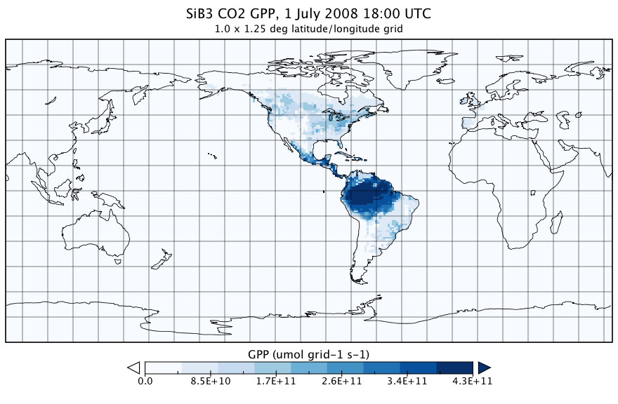
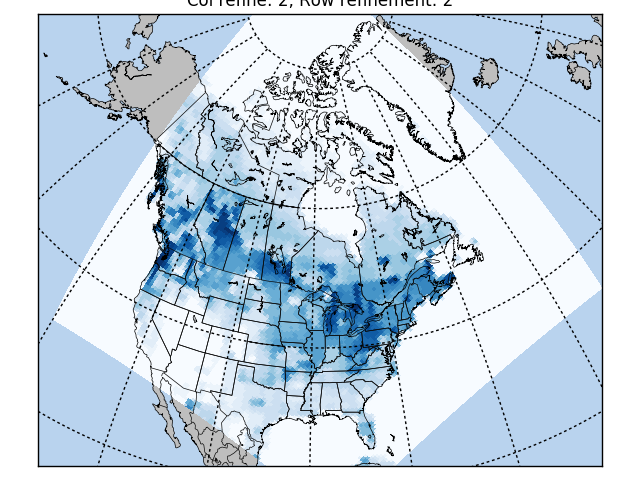
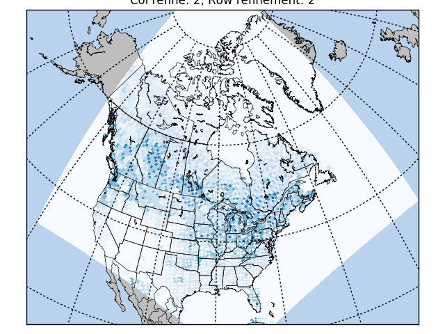

.. |H2O| replace:: H\ :sub:`2`\ O
.. |CO2| replace:: CO\ :sub:`2`\
.. |br| raw:: html

    

Usage
=====

Preliminary boilerplate
--------------------------------------------------

Import the ioapi_pytools module.

.. code-block:: python
   :linenos:

   from IOAPIPytools import ioapi_pytools

Example data
--------------------------------------------------

IOAPIPytools includes two data files to illustrate the examples below:

1. A small `EDSS/Models-3 I/O API
<https://www.cmascenter.org/ioapi/documentation/all_versions/html/>`_
data file (SiB_20080701_1.25x1.0_IOAPI.nc) containing four hours of
|CO2| gross primary productivity (GPP) and carbonyl sulfide (COS or
OCS) GPP from the Simple Biosphere Model v. 3.0 (Sellers et al., 1996;
Baker et al., 2008, 2010).

   Figure 1: First time step of SiB_20080701_1.25x1.0_IOAPI.nc.  Click
   image for full-size version.

2. An `EDSS/Models-3 I/O API
<https://www.cmascenter.org/ioapi/documentation/all_versions/html/>`_
"`GRIDDESC
<https://www.cmascenter.org/ioapi/documentation/all_versions/html/GRIDDESC.html>`_"
file (`GRIDDESCSiB <../../../../IOAPIpytools/data/GRIDDESCSiB>`_) that
describes two coordinate systems: the 1.0 x 1.25 degree global grid of
the native SiB data (SiB_grid), and a North Pole stereographic grid
with 60 kilometer grid cells that spans most of North America
(ARCNAGRID).

Example 1: Calculating regridding matrices
--------------------------------------------------

This example calculates matrices to regrid SiB data from its native
global 1.25 degree by 1.0 degree lat/lon grid to a North Pole
stereographic grid centered over North America.

.. code-block:: python
   :linenos:

   from IOAPIPytools import ioapi_pytools
   import pkg_resources  # to access the example data files
   import os
   DATA_PATH = pkg_resources.resource_filename('IOAPIPytools', 'data/')
   fname_griddesc = os.path.join(DATA_PATH, 'GRIDDESCSiB')
   ioapi_pytools.calculate_regrid_matrix(fname_griddesc=fname_griddesc,
                                         fname_matrix='my_regrid_matrix',
                                         fname_mattxt='my_regrid_mattxt',
                                         in_grid='SiB_grid',
                                         out_grid='ARCNAGRID',
                                         col_refinement=2,
                                         row_refinement=2)

Example 2: Regridding data
--------------------------------------------------

This example picks up where example 1 ended, \
using the matrices
calculated in example 1 to regrid the SiB CO2 GPP to the 60-kilometer
North American grid described in GRIDDESCSiB.

.. code-block:: python
   :linenos:

   fname_data = os.path.join(DATA_PATH, 'SiB_20080701_1.25x1.0_IOAPI.nc')
   ioapi_pytools.run_regrid(fname_raw=fname_data,
                            fname_regridded='SiB_20080701_60km_IOAPI.nc',
                            fname_matrix='my_regrid_matrix',
                            fname_mattxt='my_regrid_mattxt')

+----------------------------------------+----------------------------------------+
| |regrid00020002|                       |  |regrid10001000|                      |
|                                        |                                        |
|Figure 2: Results of example 2 as       |Figure 3: Same as fig 2., but higher    |
|written (first time step of the         |resolution column and row refinement.   |
|regridded data). Column refinement = 2, |Column refinement = 1000, row refinement|
|row refinement = 2.                     |= 1000.                                 |
|                                        |                                        |
+----------------------------------------+----------------------------------------+

References
--------------------------------------------------

Baker, I. T., L. Prihodko, A. S. Denning, M. Goulden, S. Miller,
and H. R. da Rocha (2008), Seasonal drought stress in the amazon:
Reconciling models and observations, Journal of Geophysical Research:
Biogeosciences, 113(G1), n/a–n/a, doi:`10.1029/2007JG000644
<http://dx.doi.org/10.1029/2007JG000644>`_.

Baker, I. T., A. S. Denning, and R. Stöckli (2010), North American
gross primary productivity: Regional characterization and interannual
variability, Tellus B, 62(5), 533–549,
doi:`10.1111/j.1600-0889.2010.00492.x
<http://dx.doi.org/10.1111/j.1600-0889.2010.00492.x>`_.

Sellers, P. J., D. A. Randall, G. J. Collatz, J. A. Berry, C. B. Field, D. A. Dazlich, C. Zhang, G. D. Collelo,
and L. Bounoua (1996), A Revised Land Surface Parameterization (SiB2)
for Atmospheric GCMS. Part I: Model Formulation., Journal of Climate,
9, 676–705.

--------------------------------------------------

This is a work in progress - stay tuned!

:Updated: |today|
